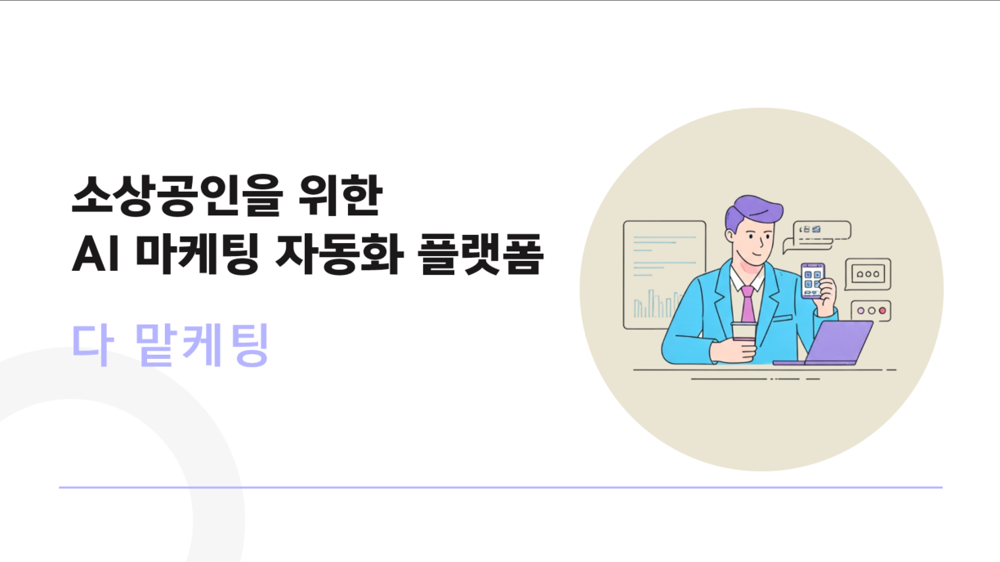
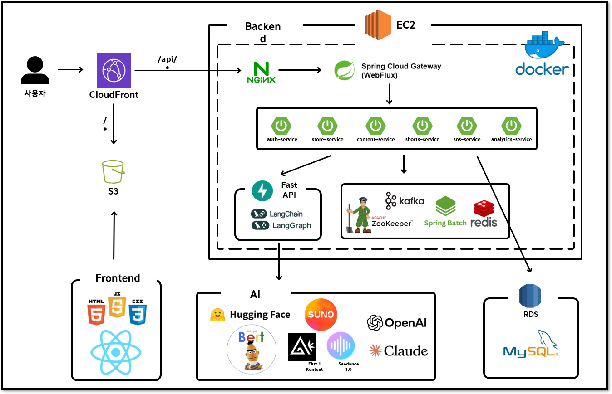

### 다 맡케팅은 AI 기반 마케팅 자동화 서비스입니다. AI를 활용한 **{ 콘텐츠 생성, SNS 자동화 및 분석 }** 을 통해 효율적인 소셜미디어 마케팅을 지원합니다.

<br>

## 📋 목차
- [👥 팀 소개](#-팀-소개)
- [🎯 프로젝트 개요](#-프로젝트-개요)
- [✨ 주요 기능](#-주요-기능)
- [🏗️ 시스템 아키텍처](#️-시스템-아키텍처)
- [🛠️ 기술 스택](#️-기술-스택)
- [📁 레포지토리 구조](#-레포지토리-구조)
- [🌐 라이브 데모](#-라이브-데모)
- [📚 문서](#-문서)
- [🤝 기여하기](#-기여하기)
- [📄 라이선스](#-라이선스)

---

## 👥 팀 소개

### KT 에이블 스쿨 7기 4조

<table>
<tr>
<td>
<br/>
<b>안성현</b><br/>
<sub><b>AI, Back-end</b></sub><br/>
<br/>
<a href="https://github.com/An-Seonghyeon">

</a>
</td>
<td>
<br/>
<b>이종수</b><br/>
<sub><b>AI, Back-end</b></sub><br/>
<br/>
<a href="https://github.com/leejongsuu">

</a>
</td>
<td>
<br/>
<b>장성희</b><br/>
<sub><b>AI, Back-end</b></sub><br/>
<br/>
<a href="https://github.com/ddanglehee">

</a>
</td>
<td>
<br/>
<b>김인서</b><br/>
<sub><b>AI, Back-end</b></sub><br/>
<br/>
<a href="https://github.com/sophinano">

</a>
</td>
<td>
<br/>
<b>주한빛</b><br/>
<sub><b>AI, Front-end</b></sub><br/>
<br/>
<a href="https://github.com/hanbiit">

</a>
</td>
<td>
<br/>
<b>최민지</b><br/>
<sub><b>AI, Front-end</b></sub><br/>
<br/>
<a href="https://github.com/choiminji-020102">

</a>
</td>
<td>
<br/>
<b>전민지</b><br/>
<sub><b>AI, Front-end</b></sub><br/>
<br/>
<a href="https://github.com/charmeee">

</a>
</td>
</tr>
</table>

---

## 🎯 프로젝트 개요

### 🗓️ 개발 기간 
2025.07.07 ~ 2025.08.29 (8주)
</br>

### 💡 배경
소상공인들은 **디지털 마케팅의 중요성**을 알고 있지만, 콘텐츠 제작에 필요한 시간과 전문 지식 부족으로 어려움을 겪고 있습니다. 특히 **숏폼 콘텐츠**의 인기가 급상승하면서, 이에 대한 수요는 높지만 제작 역량은 부족한 상황입니다.

### 🎯 목표
> **"AI 기술로 누구나 쉽게 전문적인 마케팅 콘텐츠를 만들 수 있도록 하자"**

- 🤖 **AI 자동화**: 시나리오 생성부터 영상 제작까지 자동화
- 📱 **원클릭 배포**: 제작된 콘텐츠를 여러 SNS에 동시 업로드
- 📊 **성과 분석**: 실시간 분석으로 마케팅 효과 측정
- 💰 **비용 절감**: 외주 없이 자체적으로 콘텐츠 제작

### 🎨 차별점
| **기존 솔루션** | **VS** |    **우리 플랫폼**    |
|:---:|:---:|:----------------:|
| 💸 높은 제작 비용 | → | 💰 AI 자동화로 비용 절감 |
| ⏰ 긴 제작 시간 | → |  ⚡ 10분 내 콘텐츠 완성   |
| 🔧 복잡한 도구들 | → |  🎯 올인원 통합 플랫폼   |
| 📈 분석 기능 부족 | → |   📊 실시간 성과 분석   |

---

## ✨ 주요 기능


### 회원, 매장관리
시연 흐름
1. 일반 회원가입 > 가게 추가 >  가게 수정
2. 기존 회원가입과 구글 소셜 회원가입연동
3. 신규 카카오 소셜 회원가입
](https://www.youtube.com/watch?v=E-gFf4XXeV4)

### 🏪 매장 관리 시스템
업종별 매장 정보 관리와 타겟 고객 분석을 통한 맞춤형 콘텐츠 제안

[](https://www.youtube.com/watch?v=YOUR_VIDEO_ID)

### 🤖 AI 콘텐츠 생성
매장 정보와 키워드만 입력하면 AI가 자동으로 시나리오 작성부터 영상 제작까지 완성

[](https://www.youtube.com/watch?v=YOUR_VIDEO_ID)

### 📱 SNS 자동 업로드
YouTube, Instagram, TikTok 등 여러 플랫폼에 동시 업로드 및 예약 게시

[](https://www.youtube.com/watch?v=YOUR_VIDEO_ID)


### 📊 실시간 분석 대시보드
조회수, 좋아요, 댓글 등 마케팅 성과를 실시간으로 분석하고 리포트 제시

[](https://www.youtube.com/watch?v=YOUR_VIDEO_ID)

---

## 🏗️ 시스템 아키텍처




---

## 🛠️ 기술 스택

<div align="center">

### **Backend**


### **Database & Cache**


### **Message Queue & Storage**


### **Frontend**


### **External APIs**


### **DevOps & Tools**


</div>

---

## 📁 레포지토리 구조

### 🗂️ **프로젝트 구성**


```
📦 marketing-platform-organization
├── 📁 marketing-platform 
│   ├── 📄 README.md 
│   └── 📁 assets/
├── 📁 backend
│   ├── 📄 README.md
│   ├── 📁 gateway/
│   ├── 📁 auth-service/
│   ├── 📁 store-service/
│   ├── 📁 shorts-service/
│   ├── 📁 content-service/
│   ├── 📁 sns-service/
│   ├── 📁 analytics-service/
│   └── 📁 common/
├── 📁 frontend
│   ├── 📄 README.md
│   ├── 📁 web/
│   └── 📁 mobile/
└── 📁 ai-service
    ├── 📄 README.md
    └── 📁 src/
```

<br>

### 🔗 **레포지토리 링크**
| 레포지토리 | 설명 |                                                           링크                                                            |
|:---:|:---|:-----------------------------------------------------------------------------------------------------------------------:|
| **Backend** | 마이크로서비스 백엔드 시스템 |     [](https://github.com/KT-AIVLE-04/backend)     |
| **Frontend** | React 웹 애플리케이션 |    [](https://github.com/KT-AIVLE-04/frontend)    |
| **AI Service** | FastAPI 기반 AI 서비스 | [](https://github.com/KT-AIVLE-04/backend_ai) |


---

## 🌐 **라이브 데모**
**웹사이트**: [https://aivle.r-e.kr/](https://aivle.r-e.kr/)

**테스트 계정**:
- 아이디: `aivletest0204@gmail.com`
- 비밀번호: `aivle0204`

---

## 📚 문서

### 📖 **개발 문서**
- [📋 1P 설명서](docs/1P_설명서.jpg)
- [🏗️ 요구사항 정의서](docs/요구사항정의서.xlsx)
- [🔐 API 문서](https://aivle.r-e.kr/swagger-ui/index.html#/)

### 🎓 **학습 자료**
- [🤖 AI 모델 학습 과정](docs/ai-training.md)
- [⚡ 성능 최적화](docs/performance.md)
- [🔍 트러블슈팅 가이드](docs/troubleshooting.md)

---

## 🤝 기여하기

### 💡 **참여 방법**
1. **이슈 제보**: 버그 발견 시 [Issues](https://github.com/your-org/marketing-platform/issues)에 등록
2. **기능 제안**: 새로운 아이디어나 개선사항 제안
3. **코드 기여**: Fork → 개발 → Pull Request

### 📧 **연락처**
- **기술 문의**: tjsdk34549@gmail.com
- **비즈니스 문의**: tjsdk34549@gmail.com

---

## 📄 라이선스

이 프로젝트는 [MIT License](LICENSE) 하에 있습니다.

```
MIT License

Copyright (c) 2024 KT AIVLE School 7기 4조 카오스 팀

Permission is hereby granted, free of charge, to any person obtaining a copy...
```

---

<div align="center">

**🌟 Star this project if you like it! 🌟**

[](https://github.com/KT-AIVLE-04/backend/stargazers)
[](https://github.com/KT-AIVLE-04/backend/network)

---

**© 2025 KT AIVLE School 7기 4조 카오스 팀 All rights reserved.**

*Built with ❤️ in Seoul, Korea*

</div>
